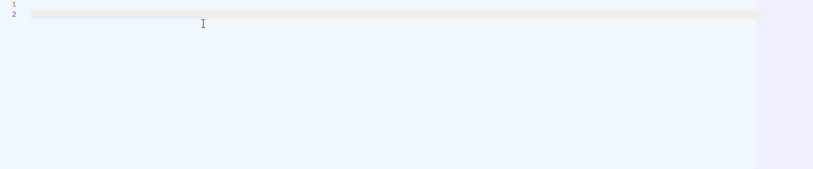
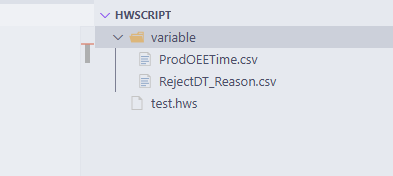

# haiwell-vscode README
Haiwell scripting support.
file extension: .hws or .hwscript

 **Features:** 
<u>Code Suggestion:</u>

## Haiwell Variables
To use haiwell variables, create a folder named `variable`. After that export the variables from Haiwell Cloud SCADA into the `variable` folder.

